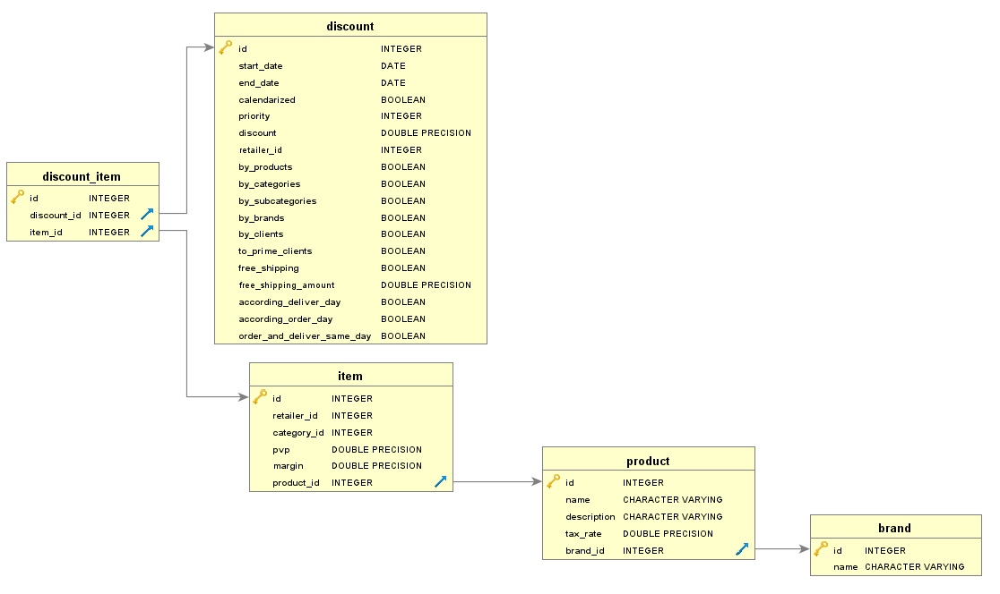

# Servicio de Items (Items service)  🏡

_Microservicio para el procesamiento de Items_

## Comenzando 🚀

_Estas instrucciones te permitirán levantar el servicio de items y hacer cambios y/o pruebas_


### Pre-requisitos 📋

_Necesitas lo siguiente para levantar el servicio en un ambiente local:_

```
Python 3.8
Postgres 12+
```


## Instalando las dependencias 📦

_Una vez instalado python y/o creado un entorno virtual para el proyecto vamos a instalar las dependencias_

```
pip install -r requirements.txt
pip install -r requirements-dev.txt
```

El segundo comando instala dependencias que son necesarias unicamente en ambientes de desarrollo.


## Configurando el entorno 📰

_El proyecto se ha configurado para funcionar con archivos de variables de entorno <code>.env</code>_

Las variables a configurar en un archivo .env son:

* __APP_PORT__: puerto en el que escuchara peticiones el servicio
* __EUREKA_SERVER__: url del servidor eureka (se pueden definir varios servidores eureka separandolos por una coma <code>,</code>)
* __DATABASE_URL__: url de la base de datos (postgres o sqlite)


Los archivos .env deben ir en la raiz de cada servicio.

## Modelo 📐

El modelo de datos del servicio es el siguiente:


 

## Uso 💻

Cada servicio ha sido documentado con OpenAPI en la cual se puede hacer peticiones. 
A continuacion los endpoints por defecto:

- [Items service](http://localhost:8002/docs) 


## Pruebas 💊

Para correr las pruebas unitarias del servicio se usa el siguiente comando:

```
pytest
```


## Coverage 💣

Para medir el coverage de los tests unitarios usamos los sigueintes comandos:

```
coverage run --source app -m pytest
coverage report
```


## Construido con 🛠️

* [Python 3.8](https://www.python.org/) - Lenguaje de programacion
* [FastAPI](https://fastapi.tiangolo.com/) - Framework web
* [Uvicorn](https://www.uvicorn.org/) - Servidor de aplicaciones asicncrono basado en ASGI
* [Postgres](https://www.postgresql.org/) - Base de datos
* [Pytest](https://docs.pytest.org/en/stable/) - Framework de pruebas unitarias

## Autor ✒️


* **Marco Yuquilima** - *Trabajo Inicial* - [yuqmettal](https://github.com/yuqmettal)